## 4 Numerical Experiments

This chapter presents numerical experiments to validate the proposed ACC framework. We first examine the end‑to‑end behavior of the learning pipeline in a controlled Black–Scholes setting. We then focus on risk‑sensitive valuation under a fixed policy and study how the learned structures behave across different levels of risk aversion.

*Remark.* *This section serves as the validations of the proposed ACC model. It focuses on numerical stability and structural consistency, rather than on performance ranking or asymptotic optimality.*

 

### 4.1 End‑to‑End Pathwise Validation

This subsection provides an end‑to‑end, pathwise validation of the proposed ACC (actor–critic–critic₀) reinforcement learning model in a controlled Black–Scholes environment. The objective is to verify that the full learning and execution pipeline produces numerically stable and structurally reasonable hedging behavior, before proceeding to more detailed analyses of risk sensitivity and policy adaptation.

#### 4.1.1 Experimental Setup

The experimental environment follows the standard Black–Scholes setting and closely matches the numerical specifications used in Section 4 of Halperin (2019). The initial underlying price is set to $S_0 = 100$, with strike price $K = 100$, corresponding to an at‑the‑money option. Volatility is fixed at $\sigma = 0.15$, and the risk‑free rate is $r = 0.03$. The drift parameter is set to $\mu = 0.05$. The option maturity is $T = 1$ year, and hedging is performed at a fixed interval of $\Delta t = 1/24$, corresponding to bi‑weekly rebalancing. A total of $50{,}000$ Monte‑Carlo paths are simulated in the numerical experiments.

Analytical Black–Scholes delta hedging is used as a benchmark, serving as a reference for hedging trajectories, portfolio value paths, and terminal profit‑and‑loss (P&L) statistics.

The ACC actor used in this experiment is trained with a large risk‑aversion parameter $\lambda = 10^5$, which corresponds to $\lambda = 1$ in the QLBS model in the Halperin(2019). In Halperin(2019), numerical experiments explicitly employ *pure risk‑based hedges*. In the present work, although the risk‑sensitive objective does not collapse exactly to a pure risk formulation, such a large value of $\lambda$ strongly suppresses the expected‑return component of the reward. As a result, the learned hedging behavior is numerically dominated by the risk term and closely approximates pure risk‑based hedging in practice.

#### 4.1.2 Pathwise Behavior

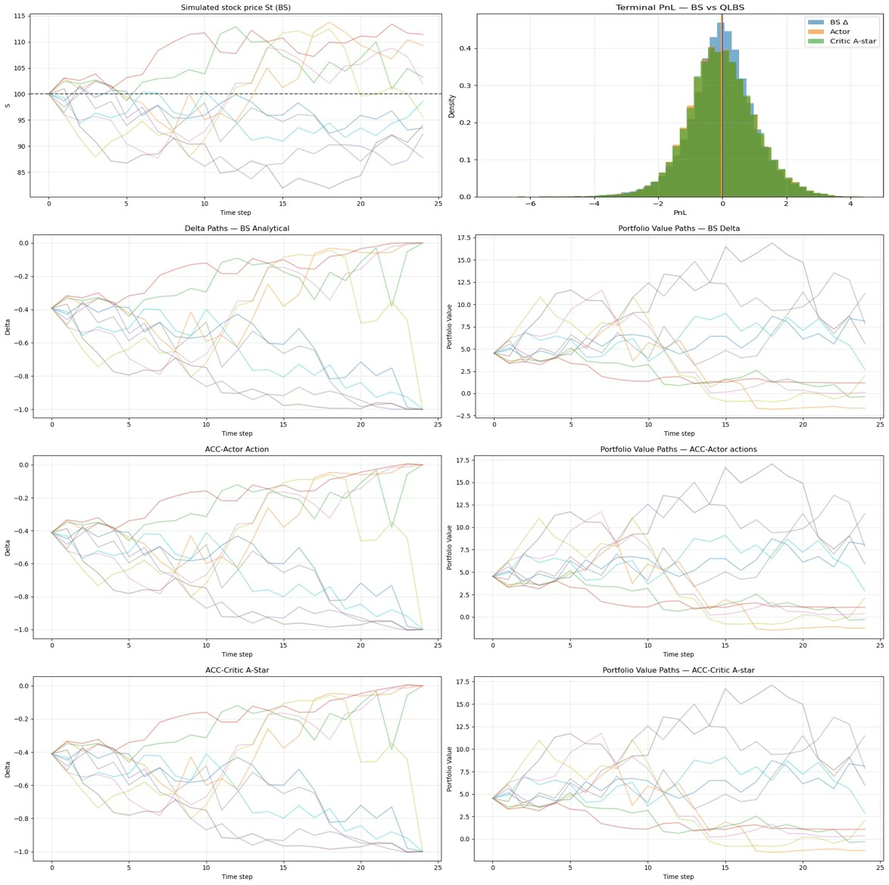

**Figure4‑1‑1** illustrates representative 10 sample paths of the underlying price, together with the corresponding hedging actions produced by analytical Black–Scholes delta hedging, the ACC‑Actor, and the ACC‑Critic (A‑star). Across non‑extreme regions of the state space, ACC‑Actor actions evolve smoothly over time and remain consistent in scale and shape with the analytical delta. The analytical optimal actions derived from the Critic (A‑star) closely track the Actor outputs along the same paths.

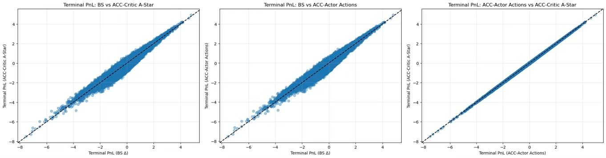

**Figure4‑1‑2** compares the resulting portfolio value trajectories under Black–Scholes delta hedging, ACC‑Actor actions, and ACC‑Critic A‑star actions. In all cases, portfolio values remain numerically stable along the sampled paths and exhibit similar overall dynamics, indicating coherent end‑to‑end execution of the ACC framework.

#### 4.1.3 Terminal P&L Statistics

Terminal P&L statistics over all Monte‑Carlo paths are summarized below. These statistics are reported to verify scale consistency and numerical stability, rather than to compare hedging efficiency:

**Table 4-1-1**: Terminal P&L statistics over all Monte‑Carlo paths under Black–Scholes delta hedging, ACC‑Actor actions, and ACC‑Critic A‑star actions

| Method | Option Price | Mean P&L | Std P&L | 5% Quantile | 95% Quantile |
|------|------|------|------|------|------|
| BS analytical delta | 4.5296 | −0.0069 | 1.0303 | −1.6978 | 1.6699 |
| ACC‑Actor | - | −0.0269 | 1.0737 | −1.7202 | 1.7674 |
| ACC‑Critic A‑star | 4.3384 | −0.0271 | 1.0740 | −1.7174 | 1.7647 |

The terminal P&L distributions produced by ACC‑Actor and ACC‑Critic A‑star closely match the Black–Scholes benchmark in both shape and scale. Mean terminal P&L remains close to zero across all methods, while ACC‑based strategies exhibit slightly higher variance than the analytical delta hedge, yet remain within the same order of magnitude. This behavior is consistent with the qualitative risk profile expected from risk‑dominated hedging strategies.

As the risk‑aversion parameter $\lambda$ increases [0, 0.001, 0.005, 0.01], the corresponding price paths shift upward in a consistent manner, reflecting the monotonic impact of risk sensitivity on valuation. 

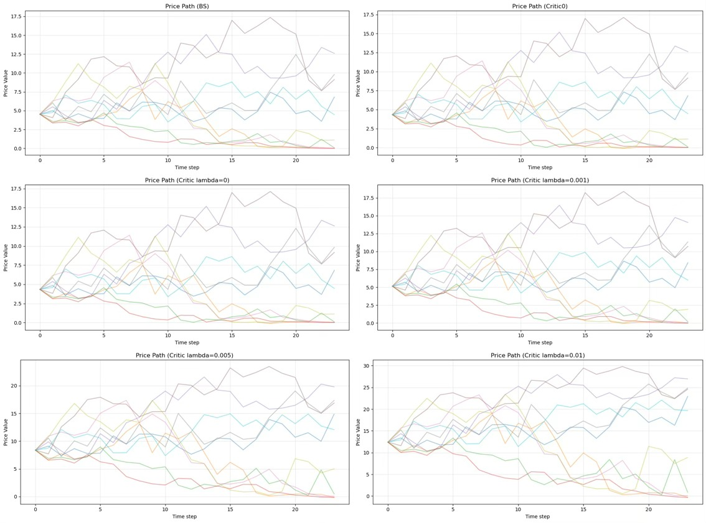

**Figure 4‑1‑3** illustrates the evolution of the option price estimated by the ACC framework under different levels of risk aversion.

This behavior is consistent with the risk‑sensitive formulation of QLBS, where larger values of $\lambda$ penalize variance more heavily and therefore lead to higher compensating prices for bearing residual hedging risk. At the initial time, the resulting option price coincides with the benchmark reported in Halperin (2019), indicating that the neural implementation preserves the same baseline valuation under vanishing or weak risk sensitivity. It is worth noting that the present framework employs a dimensionless normalization of states and rewards, which induces a rescaling of the risk‑aversion parameter. As a consequence, the numerical magnitude of $\lambda$ in this model differs from that used in the original formulation by several orders of magnitude, with the effective values corresponding to approximately a $10^4$‑fold increase after normalization. This scaling difference does not alter the qualitative dependence of prices on risk aversion, but reflects the consistent use of nondimensional variables throughout the learning architecture.

 

### 4.2 Risk‑Sensitive Valuation under a Fixed Policy

This subsection studies the numerical behavior of risk‑sensitive valuation under a fixed policy. In all experiments, the actor and the baseline critic (critic₀) are kept fixed. Variance of risk‑sensitive critics are trained for valuation. This design allows us to isolate the effect of the risk-lambda $\lambda$ on the valuation structure.

The experimental setting differs from that in Section4.1. The underlying price is initialized at $S_0 = 100.0$. The drift is set to $\mu = 0.3$ (The drift is intentionally set to $\mu = 0.3$ to verify that the ACC framework remains numerically stable and well‑behaved even outside a strictly λ‑free baseline setting.), and the risk‑free rate is $r = 0.03$. Volatility is fixed at $\sigma = 0.2$. The option maturity is $T = 0.5$, discretized into $T_{\text{steps}} = 50$ time steps with $\Delta t = 0.01$. The strike price is $K = 100.0$, and a put option is considered. Both the **actor** and **critic₀** are trained with dimensionless risk‑aversion parameter $\lambda = 100{,}000$.

Using this fixed environment and policy, we train multiple risk‑sensitive **critics** with different values of $\lambda$, including $\lambda \in {0.1, 1.0, 10.0, 100.0, 2500.0, 5000.0, 7500.0, 10000.0, 25000.0, 50000.0}$. The resulting valuation outputs across these risk‑aversion levels are analyzed in the following subsections to assess how risk sensitivity influences the learned valuation structure and to validate the effectiveness of the ACC framework under varying $\lambda$.

#### 4.2.1 Numerical instability at small risk‑aversion levels

**Figure 4‑2‑1** shows valuation paths produced by the risk‑sensitive critic for different values of the risk‑aversion parameter $\lambda$. For reference, the figure also includes paths generated by the Black–Scholes analytical delta and by the ACC‑Actor under the same market realizations.

When $\lambda$ takes small values, the valuation outputs of the risk‑sensitive critic become highly unstable. Large dispersion is observed across sample paths, and no consistent temporal structure is formed. The overall scale of the outputs also varies significantly across trajectories.

This behavior arises because, in the small‑$\lambda$ regime, the risk‑sensitive $Q$‑function becomes nearly linear in the action variable. The quadratic risk term, which provides curvature and a well‑defined optimum, becomes numerically weak. As a result, the learning signal available to the neural critic is dominated by noise, and the data‑driven reinforcement learning process is unable to reliably identify the underlying quadratic structure from sample trajectories.

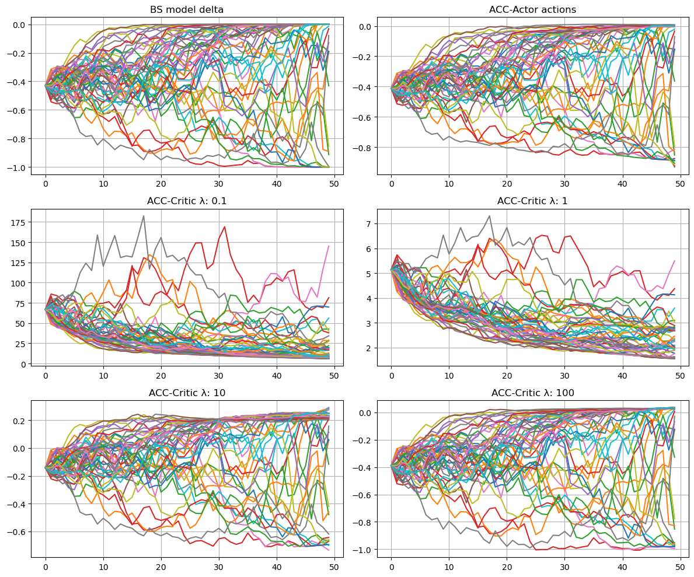

**Figure 4‑2‑1**: Valuation behavior of the risk‑sensitive critic across different risk‑aversion levels

#### 4.2.2 Stable valuation structure in the large‑$\lambda$ regime

**Figure4‑2‑2** visualizes the relationship between the action and the corresponding estimated price produced by the risk‑sensitive critic. Each curve in the figure represents a price–action profile evaluated under a fixed state for a given value of the risk‑aversion parameter.

For moderate and large values of $\lambda$, the price–action curves exhibit a smooth and well‑defined quadratic shape. The presence of clear curvature indicates that the risk term actively contributes to the valuation, leading to an interior optimum in the action direction. As $\lambda$ increases, the curves shift upward in a systematic way, reflecting increased compensation for risk exposure.

As $\lambda$ is reduced, the curvature of these curves progressively weakens. In the small‑$\lambda$ regime, the price–action relationship approaches an almost linear form, and the quadratic structure becomes difficult to distinguish numerically. This transition from quadratic to near‑linear behavior provides direct experimental evidence for the observations in Section4.2.1. When the curvature vanishes, the learning problem no longer presents a well‑defined second‑order structure, which explains why data‑driven reinforcement learning struggles to recover stable valuations in this regime.

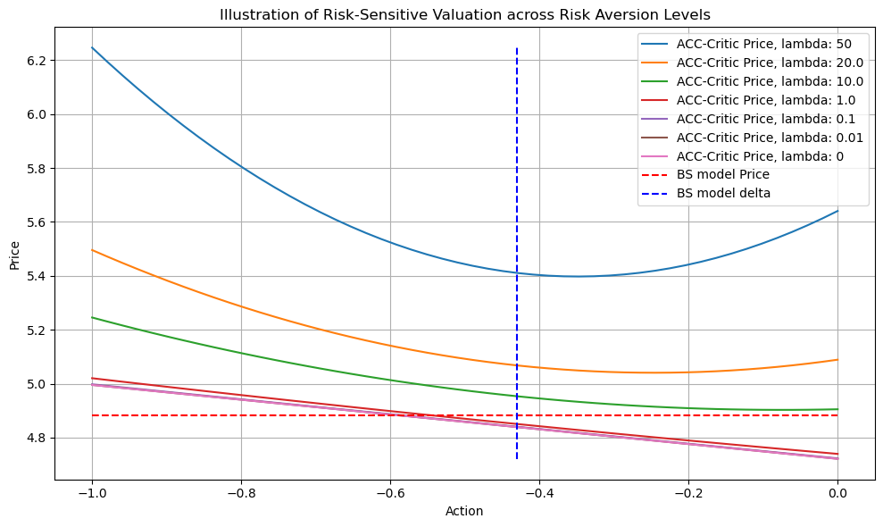

**Figure 4‑2‑2**: Illustration of risk‑sensitive valuation as a function of action across risk‑aversion levels

#### 4.2.3 Structural consistency of the learned coefficients

The structural properties of risk‑sensitive valuation are examined through the coefficients of the quadratic approximation of the Q‑function. The coefficients $\Theta^{(0)}$, $\Theta^{(1)}$, and $\Theta^{(2)}$, defined in Section 3.3.5, correspond to the constant term, the linear action‑coupling term, and the quadratic risk‑penalty term, respectively.

Figure 4‑2‑3 reports these coefficients as functions of the risk‑aversion parameter $\lambda$ under different configurations. Table 4‑2‑3 summarizes their empirical means and standard deviations. Across all settings, the coefficients exhibit an approximately linear dependence on $\lambda$ and remain within stable numerical ranges.

The quadratic coefficient $\Theta^{(2)}$ is tightly concentrated around a constant scale, with limited variation across moneyness and maturity. This behavior is consistent with its dependence on the second moment of price increments.

In contrast, the coefficients $\Theta^{(0)}$ and $\Theta^{(1)}$ vary more significantly with moneyness and time to maturity, reflecting accumulated portfolio variance and its interaction with price changes. Despite this variation, their magnitudes remain well controlled and preserve the quadratic valuation structure.

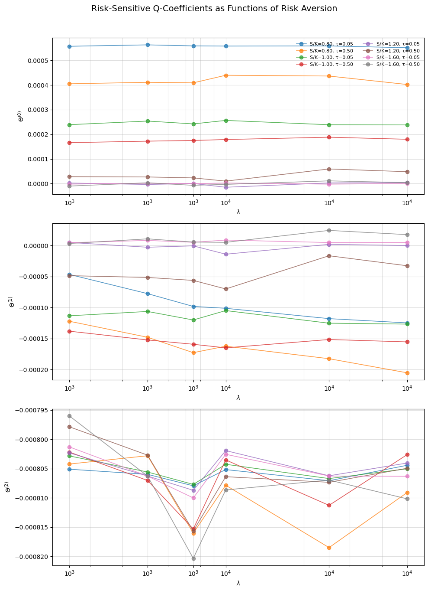

**Figure 4‑2‑3**: Risk‑sensitive Q‑coefficients as functions of the risk‑aversion parameter

**Table 4-2-3**: Summary statistics of the learned risk lambda under fixed policy evaluation. Values are reported as mean ±
standard deviation for selected moneyness and time‑to‑maturity levels.

| S/K | τ   | Θ⁽⁰⁾ mean ± std | Θ⁽¹⁾ mean ± std | Θ⁽²⁾ mean ± std |
|-----|-----|------------------|------------------|------------------|
| 0.8 | 0.05 | 5.58e‑4 ± 3.0e‑6 | −9.4e‑5 ± 2.6e‑5 | −8.06e‑4 ± 1.0e‑6 |
| 0.8 | 0.50 | 4.17e‑4 ± 1.5e‑5 | −1.65e‑4 ± 2.6e‑5 | −8.10e‑4 ± 6.0e‑6 |
| 1.0 | 0.05 | 2.45e‑4 ± 7.0e‑6 | −1.16e‑4 ± 9.0e‑6 | −8.05e‑4 ± 2.0e‑6 |
| 1.0 | 0.50 | 1.77e‑4 ± 7.0e‑6 | −1.54e‑4 ± 8.0e‑6 | −8.07e‑4 ± 5.0e‑6 |
| 1.2 | 0.05 | −1.41e‑6 ± 6.0e‑6 | −2.0e‑6 ± 6.0e‑6 | −8.05e‑4 ± 2.0e‑6 |
| 1.2 | 0.50 | 3.28e‑5 ± 1.6e‑5 | −4.6e‑5 ± 1.7e‑5 | −8.06e‑4 ± 5.0e‑6 |
| 1.6 | 0.05 | 2.11e‑8 ± 2.0e‑6 | 6.0e‑6 ± 2.0e‑6 | −8.05e‑4 ± 3.0e‑6 |
| 1.6 | 0.50 | −1.84e‑7 ± 7.0e‑6 | 1.1e‑5 ± 8.0e‑6 | −8.08e‑4 ± 7.0e‑6 |

### 4.3 Summary
This chapter presented numerical experiments to validate the proposed ACC framework in a risk‑sensitive setting. The focus was on numerical stability and structural consistency, rather than on performance comparison.

End‑to‑end pathwise experiments showed that the ACC framework produces stable and well‑behaved hedging strategies in a standard Black–Scholes environment. Hedging actions, portfolio dynamics, and terminal P&L distributions were all consistent in scale and structure with analytical Black–Scholes benchmarks. These results confirm that the overall training and execution pipeline is numerically reliable.

Further analysis examined risk‑sensitive valuation under a fixed policy. When the risk‑aversion parameter is small, the valuation function becomes nearly linear in the action variable. In this regime, the quadratic risk structure is weak and difficult to recover from finite data, which leads to instability in neural network–based valuation learning. This behavior reflects a general limitation of data‑driven reinforcement learning under weak structural signals.

The key result of this chapter is that the ACC structure provides an effective way to address this issue. By training the actor with a sufficiently large risk‑aversion parameter, the resulting policy becomes numerically dominated by risk considerations. This behavior is numerically equivalent to the pure risk‑based hedge considered in the QLBS framework (Halperin, 2019). Under this fixed and risk‑dominated policy, the ACC formulation allows risk‑sensitive $Q$‑values to be generated consistently for different levels of risk aversion without retraining the models.

The coefficient analysis further supports this conclusion. The quadratic risk term remains stable across states, while the linear and constant terms vary with time and moneyness in a controlled manner. These patterns match the theoretical structure derived in the risk‑sensitive case and demonstrate that the neural approximation preserves the intended valuation form.

Overall, the numerical results show that the ACC framework can reliably capture risk‑sensitive valuation structures using a single, risk‑dominated policy. This separation between policy learning and valuation analysis represents a practical advantage of the proposed approach and provides a solid numerical foundation for risk‑sensitive reinforcement learning in option pricing.

## 5 Option Analysis of the ACC Framework for Risk‑Sensitive Analysis

This chapter applies the ACC framework to risk‑sensitive analysis in option pricing. Using the validated model, we examine the effects of risk aversion under extended market settings, including stochastic volatility, implied volatility structures, and transaction costs.

### 5.1 Extension to Stochastic Volatility Models

This subsection extends the ACC framework to a stochastic volatility environment based on the Heston model. The purpose is to examine whether the numerical stability and structural properties observed under the Black–Scholes model persist when volatility itself follows stochastic dynamics. The ACC architecture and training procedure are kept unchanged, and only the market dynamics are modified. The objective is not to recover the Heston pricing mechanism, but to validate numerical stability under stochastic volatility.

#### 5.1.1 Experimental Setup under the Heston Model

The experimental environment follows a standard Heston stochastic volatility specification. The initial asset price is set to $S_0 = 100.0$, and the initial variance is $V_0 = 0.04$. The drift parameter is $\mu = 0.08$, and the risk‑free rate is $r = 0.03$. The variance process is governed by mean‑reversion speed $\kappa = 1.5$, long‑run variance level $\theta = 0.04$, and volatility of volatility $\sigma_v = 0.25$. The option maturity is $T = 0.25$, discretized into $T_{\text{steps}} = 60$ time steps with $\Delta t = 0.00417$. The strike price is $K = 100.0$, and a put option is considered.  

The actor is trained with a large dimensionless risk‑aversion parameter $\lambda = 10^5$, yielding a risk‑dominated hedging policy. Analytical Heston delta hedging is used as a benchmark for comparison, serving as a reference for hedging actions, portfolio value trajectories, and terminal profit‑and‑loss (P\&L) statistics.

#### 5.1.2 Pathwise Behavior under the Heston Model

Figure 5‑1‑1 illustrates representative 10 sample paths generated under the Heston model, together with the corresponding hedging actions and portfolio value trajectories. The layout mirrors that of Section 4.1 and includes comparisons between the analytical Heston hedge, the ACC‑Actor actions, and the optimal actions derived from the ACC‑Critic (A‑star).

Across non‑extreme regions of the state space, the ACC‑Actor produces hedging actions that evolve smoothly over time. The resulting portfolio value paths remain numerically stable and exhibit coherent dynamics across sample trajectories. The overall behavior of the ACC‑based strategies is consistent with the analytical benchmark, indicating stable end‑to‑end execution of the ACC framework under stochastic volatility.

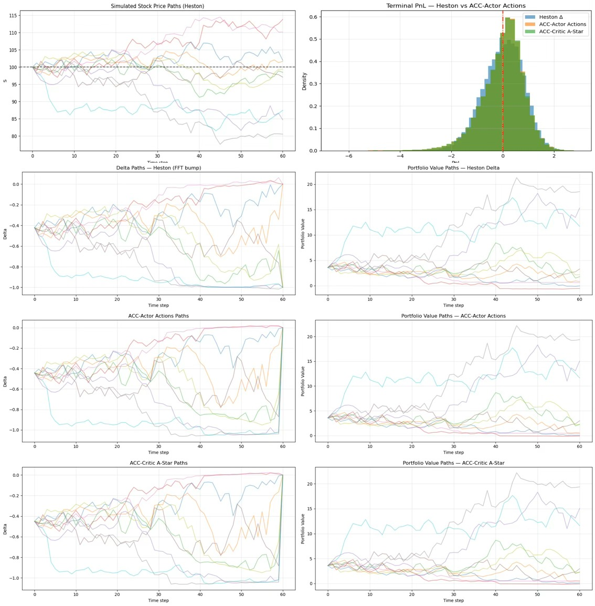

**Figure 5‑1‑1**: Pathwise behavior of hedging actions and portfolio values under the Heston model

#### 5.1.3 Terminal P&L Statistics under the Heston Model

Terminal P\&L statistics over all Monte‑Carlo paths are summarized below, following the same format as in Section 4.1.

**Table 5-1-1**: Terminal P&L statistics over all Monte‑Carlo paths under Heston delta hedging, ACC‑Actor actions, and ACC‑Critic A‑star actions

<table>
<tr>
<th>Method</th>
<th>Mean P&amp;L</th>
<th>Median P&amp;L</th>
<th>Std P&amp;L</th>
<th>5% Quantile</th>
<th>95% Quantile</th>
</tr>
<tr>
<td>Heston analytical hedge</td>
<td>0.0039</td>
<td>0.0593</td>
<td>0.8048</td>
<td>-1.3943</td>
<td>1.2249</td>
</tr>
<tr>
<td>ACC‑Actor</td>
<td>-0.0059</td>
<td>0.1096</td>
<td>0.8369</td>
<td>-1.4994</td>
<td>1.1718</td>
</tr>
<tr>
<td>ACC‑Critic A‑star</td>
<td>-0.0059</td>
<td>0.1041</td>
<td>0.8323</td>
<td>-1.4766</td>
<td>1.1692</td>
</tr>
</table>

Figure 5‑1‑2 compares the terminal P\&L distributions across the three hedging strategies. The distributions produced by the ACC‑Actor and the ACC‑Critic A‑star closely match the analytical Heston benchmark in both shape and scale. Mean terminal P\&L values remain close to zero, and dispersion stays within the same order of magnitude across approaches.

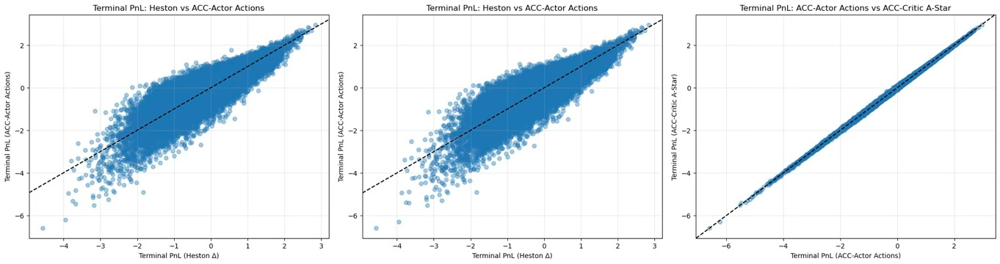

**Figure 5‑1‑2**: Terminal P&amp;L distributions under the Heston model

The results above indicate that the ACC framework remains numerically stable and trainable under stochastic volatility dynamics. In contrast to the Black–Scholes setting, the Heston model introduces path‑dependent variability through the latent variance process, and the present experiment therefore focuses on validating pathwise behavior rather than full state‑space generalization. Within this scope, the observed hedging behavior and terminal P&L statistics validating that the ACC framework remains numerically stable and structurally consistent when applied to stochastic volatility environments.

### 5.2 Risk‑Sensitive Implied Volatility Analysis

This section studies implied volatility structures generated by risk‑sensitive valuation under a fixed hedging policy. The objective is not to replicate stochastic volatility dynamics, but to examine how discrete‑time, risk‑sensitive pricing modifies implied prices relative to classical benchmarks.

The focus is on the shape of implied volatility curves obtained by inverting prices produced by the risk‑sensitive critic under a fixed hedging policy. In the Black–Scholes and Heston settings, the ACC systems are trained separately using data generated from the corresponding market models, while sharing the same network architecture and training procedure. In each case, hedging actions are produced by the ACC‑Actor trained with a large risk‑aversion parameter $\lambda = 10^5$. Prices and implied volatilities for other values of $\lambda$ are obtained through the structured affine extension of the learned risk‑sensitive $Q$‑function, without retraining the policy.

Both the Black–Scholes model and the Heston stochastic volatility model are examined using a short maturity $T = 0.25$. This maturity is chosen because implied volatility curves are typically more visible at shorter horizons. The structural effects induced by risk‑sensitive valuation can therefore be observed more clearly.

#### 5.2.1 Implied Volatility in the Black–Scholes Model

We first consider the Black–Scholes setting. 

The underlying price is initialized at $S_0 = 100.0$.  The risk‑free rate is $r = 0.03$ and Volatility is fixed at $\sigma = 0.2$, same as Section 4.2. But the drift is set to $\mu = 0.08$, same as drift of Heston model sample. The option maturity is $T = 0.25$, discretized into $T_{\text{steps}} = 25$ time steps with $\Delta t = 0.01$. The strike price is $K = 100.0$, and a put option is considered. Both the **actor** and **critic₀** are trained with dimensionless risk‑aversion parameter $\lambda = 100{,}000$.

Using the same trained ACC system, prices and implied volatilities for other values of $\lambda \in {0, 10, 20, 50}$ are obtained through the structured affine extension of the learned risk‑sensitive $Q$‑function. Under the Black–Scholes model, analytical pricing implies a flat implied volatility curve across strikes. 

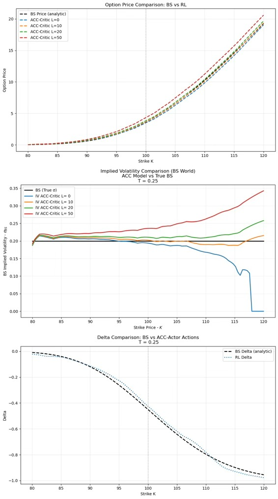

**Figure 5‑2‑1**: Option price, implied volatility and hedge actions comparison in the Black–Scholes model and ACC model

Under the fixed risk‑dominated hedging policy generated by the ACC‑Actor, ACC‑Critic prices exhibit an overall upward shift as the risk‑aversion parameter $\lambda$ increases. This uplift is observed across the strike range and becomes more pronounced in deep in‑the‑money regions. It reflects the additional compensation required for residual hedging risk under risk‑sensitive valuation.

When these prices are inverted to implied volatilities, the resulting curves are no longer flat. Instead, the implied volatility curves generated by the ACC framework display a curvature. As $\lambda$ increases, this curvature becomes stronger. The implied volatility rises more steeply in deep in‑the‑money regions. This result illustrates that, under discrete‑time hedging, risk‑sensitive valuation can introduce curvature into implied prices even when the underlying dynamics follow the Black–Scholes model.

At $\lambda = 0$, the inferred implied volatility curve already shows the dependence on the strike. Its overall skew is qualitatively consistent with patterns commonly observed in real markets. This behavior can be attributed to residual risk in the discrete‑time valuation framework. Prices generated in discrete time are typically lower than continuous‑time Black–Scholes values, which leads to compression of implied volatility in extreme strike regions. 

Overall, the Black–Scholes analysis demonstrates that, under a fixed risk‑dominated hedging policy, risk‑sensitive valuation can produce implied volatility curves with curvature and skew. This setting provides a clear baseline for comparison with the stochastic volatility results discussed in the next subsection.

#### 5.2.2 Implied Volatility under the Heston Model

This subsection analyzes implied volatility patterns under the Heston stochastic volatility model. Hedging actions are generated by a fixed ACC‑Actor trained with a large risk‑aversion parameter $\lambda = 10^5$. Option prices and implied volatilities for other values of $\lambda \in \{0, 0.5, 5, 20, 50\}$ are obtained through the affine extension of the learned risk‑sensitive $Q$‑function.

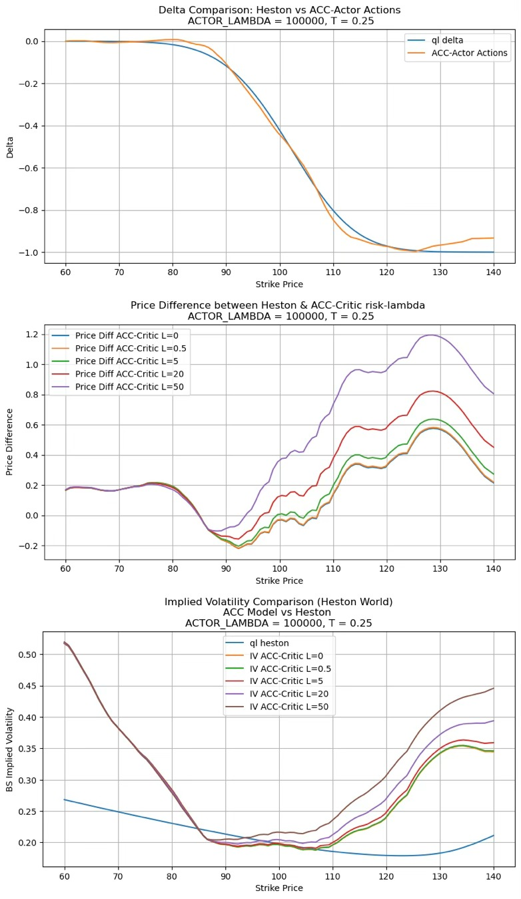

**Figure 5‑2‑2**: Risk‑sensitive behavior under the Heston model. The ACC framework generates stable hedging actions, interpretable price adjustments, and a more pronounced implied volatility smile as risk aversion increases.

Figure 5‑2‑2 summarizes three perspectives on the risk‑sensitive behavior under stochastic volatility. The top panel compares the analytical Heston delta with the hedging actions produced by the ACC‑Actor. The two curves closely align around the at‑the‑money region, while the ACC‑Actor exhibits slightly more conservative behavior in deep in‑the‑money and deep out‑of‑the‑money regions. This reflects the influence of risk sensitivity in regions with higher uncertainty. The middle panel reports price differences between the analytical Heston benchmark and the ACC‑Critic for different values of the risk‑aversion parameter $\lambda$. The price adjustment induced by risk aversion is small near the at‑the‑money region and increases monotonically toward the deep in‑the‑money side. 

The bottom panel shows the corresponding implied volatility curves. Under the current Heston parameters, the analytical implied volatility exhibits mainly a one‑sided structure, with limited uplift on the deep in‑the‑money side. In contrast, the ACC model generates a more pronounced implied volatility smile under risk‑sensitive pricing. The implied volatility curve becomes substantially steeper on the deep in‑the‑money side as $\lambda$ increases, while also remaining elevated on the out‑of‑the‑money side. This indicates that risk‑sensitive pricing through the ACC framework amplifies tail‑risk compensation beyond the baseline stochastic volatility effect.

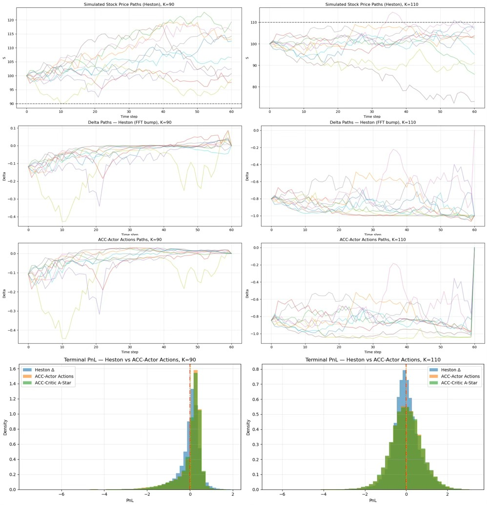

**Figure 5‑2‑3**: Pathwise behavior of hedging actions when K=90 and K=110

As shown in Fig. 5.2.3, when K=90, the terminal PnL obtained under the ACC framework is overall better than that produced by the Heston model. As a consequence, the corresponding option price under ACC is lower than the price given by the Heston model in Fig. 5.2.2. In contrast, when K=110, the terminal PnL variance under the ACC framework is clearly larger than that under the Heston model. As a result, under risk‑sensitive pricing, the ACC option price increases at a faster rate, which explains the pronounced price uplift observed in Fig. 5.2.2 for K > 110.

### 5.3 Numerical Analysis under Transaction Costs

This subsection examines the impact of market frictions on risk‑sensitive hedging and pricing within the ACC framework. All experiments are conducted under the same Heston stochastic volatility environment and network architecture as in the previous sections. Transaction costs are introduced through a penalty term in the reward function, while all other model specifications and training settings remain unchanged. Two transaction cost levels are considered: $\mathrm{TC}=0.0005$, corresponding to a realistic one‑basis‑point trading and holding cost, and $\mathrm{TC}=0.005$, representing an amplified friction level used to highlight the model response to transaction cost signals.

The one‑step reward function takes the form
$$
R_t(TC) \;=\; R_t -\; \mathrm{TC}_t,
$$
where $\mathrm{TC}_t$ denotes the transaction cost incurred by rebalancing the hedging position at time $t$. This cost term enters the reward as a positive penalty.

Table 5‑3‑1 summarizes terminal P\&L statistics and average transaction costs under different transaction cost levels for the analytical Heston $\Delta$ hedge and the ACC‑Actor. Since the ACC‑Actor and ACC‑Critic A‑Star produce nearly identical statistical outcomes across all reported metrics, only ACC‑Actor results are included to avoid redundancy.

**Table 5‑3‑1: Terminal P\&L and Transaction Cost Statistics under the Heston Model**

<table>
<tr>
<th>Transaction Cost Rate</th>
<th>Method</th>
<th>Mean P&amp;L</th>
<th>Median P&amp;L</th>
<th>Std P&amp;L</th>
<th>5% Quantile</th>
<th>95% Quantile</th>
<th>Mean TC</th>
</tr>
<tr>
<td>0.0</td>
<td>Heston analytical hedge</td>
<td>0.0039</td>
<td>0.0593</td>
<td>0.8048</td>
<td>−1.3943</td>
<td>1.2249</td>
<td>0.0000</td>
</tr>
<tr>
<td>0.0</td>
<td>ACC‑Actor</td>
<td>−0.0059</td>
<td>0.1096</td>
<td>0.8369</td>
<td>−1.4994</td>
<td>1.1718</td>
<td>0.0000</td>
</tr>
<tr>
<td>0.0005</td>
<td>Heston analytical hedge</td>
<td>−0.1365</td>
<td>−0.0826</td>
<td>0.8085</td>
<td>−1.5266</td>
<td>1.0906</td>
<td>0.1282</td>
</tr>
<tr>
<td>0.0005</td>
<td>ACC‑Actor</td>
<td>−0.1550</td>
<td>−0.0150</td>
<td>0.8674</td>
<td>−1.7178</td>
<td>1.0234</td>
<td>0.1416</td>
</tr>
<tr>
<td>0.005</td>
<td>ACC‑Actor</td>
<td>−1.3783</td>
<td>−1.2579</td>
<td>1.2257</td>
<td>−3.5831</td>
<td>0.2174</td>
<td>1.3716</td>
</tr>
<tr>
<td>0.005</td>
<td>ACC‑Critic A‑star</td>
<td>−1.3819</td>
<td>−1.2670</td>
<td>1.2358</td>
<td>−3.5933</td>
<td>0.2334</td>
<td>1.3761</td>
</tr>
</table>

Comparing the terminal Profit and Loss (P&L) distributions across three diagrams: zero transaction costs (TC=0, Figure 5‑1‑1), low transaction costs (TC=0.0005, Figure 5‑3‑2), and relatively high transaction costs (TC=0.005, Figure 5‑3‑1). For the Heston analytical hedging benchmark, the P&L distribution shifts continuously and uniformly to the left (toward negative values) as transaction costs increase. Although the P&L distribution of the ACC-Actor strategy also shifts left with rising frictions, it shows a significant drag effect. Under the low-friction condition of $TC=0.0005$, its distribution nearly coincides with the Heston benchmark, while the ACC-Actor distribution forms a bimodal structure with two concentrated peaks in the left loss region and near $0$ when transaction costs increase to $TC=0.005$.

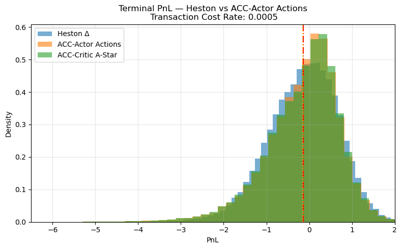

**Figure 5‑3‑1**: Terminal P\&L distributions under the Heston model with transaction cost rate $\mathrm{TC}=0.0005$

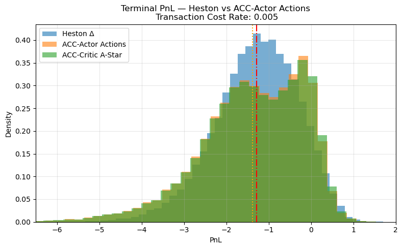

**Figure 5‑3‑2**: Delta comparison between analytical Heston $\Delta$ and ACC‑Actor actions with $\mathrm{TC}=0.005$

Figures 5‑3‑3 and 5‑3‑4 compare the analytical Heston model $\Delta$ with the hedging actions produced by the ACC‑Actor, together with the implied volatility curves derived from the corresponding pricing results. As transaction costs increase, the implied volatility curves inferred from ACC‑based pricing become steeper and shift upward relative to the Heston baseline, reflecting enhanced compensation for trading frictions within the valuation output.

Results indicate that the ACC framework responds consistently to transaction cost signals during training and adjusts its hedging strategy accordingly. Importantly, this subsection aims to verify the responsiveness of the ACC framework to market friction, not to compare the hedging performance of different strategies.

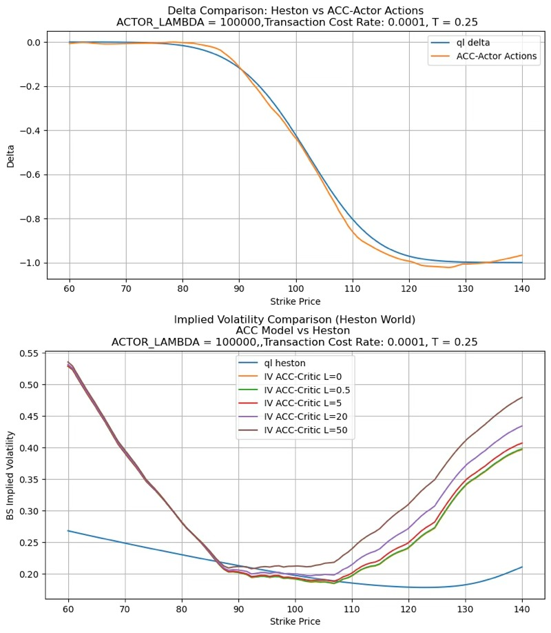

**Figure 5‑3‑3**: Delta comparison and IV Cpmparision between analytical Heston $\Delta$ and ACC‑Actor actions with $\mathrm{TC}=0.0001$

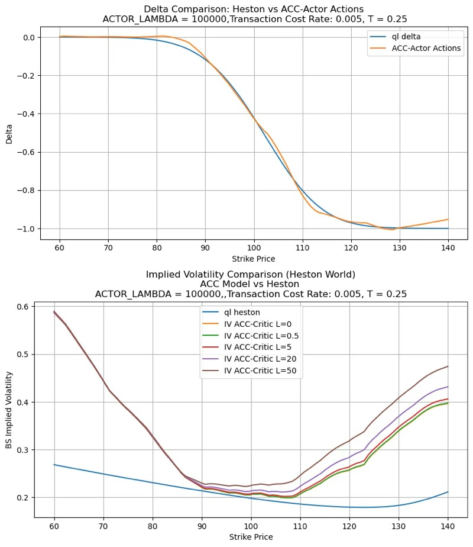

**Figure 5‑3‑4**: Delta comparison and IV Cpmparision between analytical Heston $\Delta$ and ACC‑Actor actions with $\mathrm{TC}=0.005$

### 5.4 Risk‑Sensitive Black–Scholes Valuation Compared with Stochastic Volatility Benchmarks

This section provides an integrated analysis of the ACC framework based on the Black–Scholes dynamics with risk aversion and transaction costs. The focus is on numerical consistency and deviation patterns between ACC‑based results and stochastic volatility pricing, with the Heston model serving as the reference benchmark.

The Black–Scholes and Heston model parameters used in this section are identical to those in Section 5.2. A transaction cost rate of $ \mathrm{TC} = 0.0005 $ is applied uniformly across all experiments. In the Black–Scholes setting, the volatility is fixed at a constant level $ \sigma = 0.2 $. This value is close to the implied volatility generated by the corresponding Heston parameter set in the at‑the‑money and in‑the‑money regions, ensuring comparability between the two models over economically relevant strikes.

To facilitate interpretation, the strike domain is divided into four regions based on observed numerical behavior:  
(1) a *Noise‑Dominated Region*,  
(2) a *Core Strike Region*,  
(3) a *Risk‑Aversion Dominated Region*, and  
(4) a *Limited Data Region*.  
This classification is used solely as a descriptive tool to organize pricing and implied volatility results.

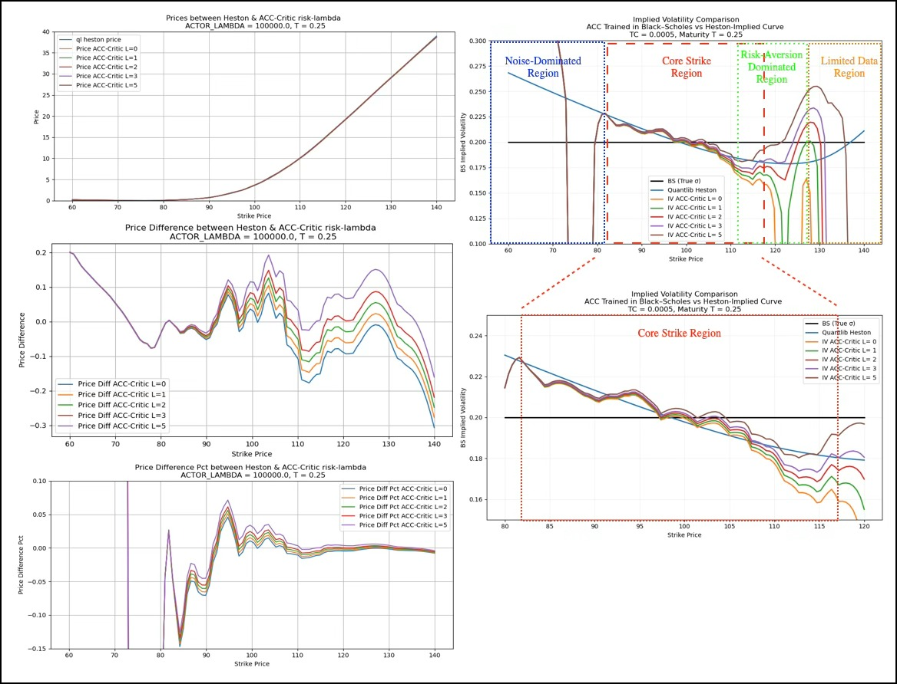

**Figure 5‑4**: Option price and implied volatility comparison between the Heston model and the ACC framework under Black–Scholes dynamics with constant volatility $ \sigma = 0.2 $ and transaction costs $ \mathrm{TC} = 0.0005 $. The strike domain is divided into four regions: Noise‑Dominated (blue), Core Strike (red), Risk‑Aversion Dominated (green), and Limited Data (orange). ACC prices closely match Heston prices in the Core Strike Region. Implied volatility curves derived from risk‑sensitive valuation reproduce key shape features of stochastic volatility models across regions with sufficient data support.

#### 5.4.1 Option Price Comparison

Under the above specification, the ACC framework extends the classical Black–Scholes environment through risk‑sensitive valuation and discrete‑time hedging with transaction costs. Although the underlying volatility process remains deterministic, Figure 5‑4 shows that ACC‑Critic option prices closely match Heston prices in the *Core Strike Region*, approximately $ K = 85\text{–}115 $. In the at‑the‑money and in‑the‑money range, relative pricing differences are typically within 2%. This region corresponds to the most liquid and economically meaningful segment of option valuation.

In the *Noise‑Dominated Region* at lower strikes, relative price differences exhibit pronounced fluctuations. However, absolute price deviations remain small, generally below 0.2 in monetary units. Since option values in this region are already low, percentage differences are mainly driven by numerical amplification rather than structural pricing discrepancies.

Across the *Risk‑Aversion Dominated and Limited Data Region*, pricing differences remain controlled. Overall pricing deviations relative to the Heston benchmark remain limited, indicating stable valuation behavior under risk‑sensitive pricing.

#### 5.4.2 Implied Volatility Comparison

Implied volatility curves are obtained by inverting ACC prices under the Black–Scholes model. Despite the constant volatility assumption, the resulting curves exhibit clear curvature and strike dependence. Within the *Core Strike Region*, ACC‑implied volatility closely matches the Heston benchmark in both level and local slope.

As strikes increase beyond approximately $K \approx 115$, entering the *Risk‑Aversion Dominated Region*, implied volatility curves corresponding to different risk‑aversion levels begin to separate. Higher risk aversion produces more pronounced curvature and higher implied volatility levels. This effect is further amplified when transaction costs are included.

In the *Limited Data Region*, typically observed for $K \gtrsim 135$, ACC‑implied volatility declines rapidly. This behavior is associated with data sparsity and numerical instability from extrapolation. As a result, this region is excluded from structural interpretation. Pricing deviations relative to the Heston benchmark remain small in absolute terms.

